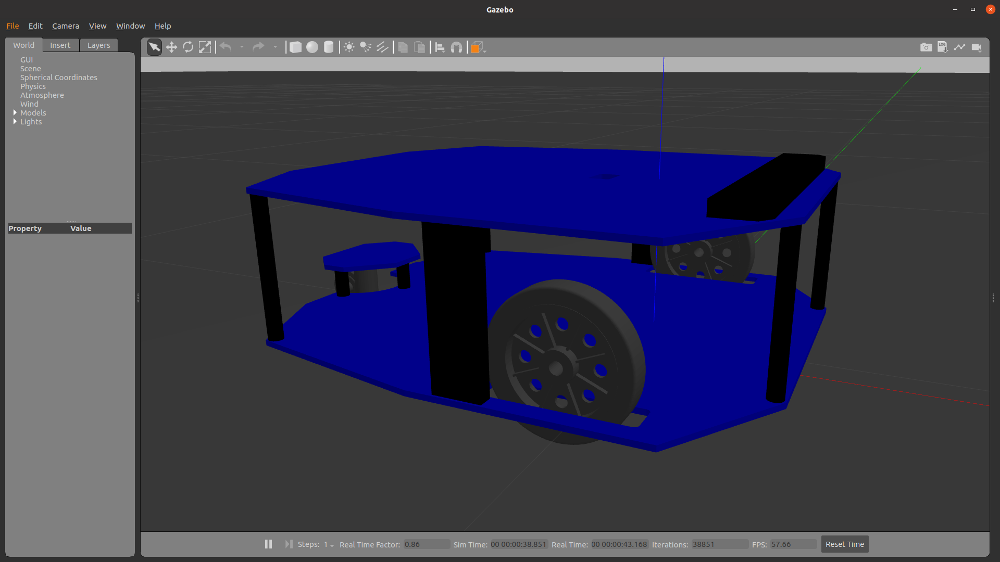
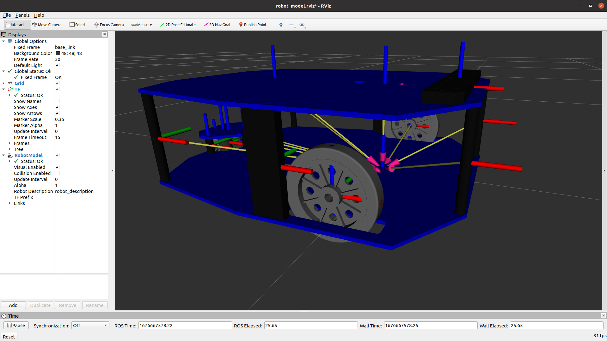

# Paquetes de ROS para el robot RoMAA

> :memo: El repositorio `romaa_ros` con el driver del robot RoMAA fue renombrado a `romaa_driver` ([link](https://github.com/ciiiutnfrc/romaa_driver))

<p float="center">
  
  
</p>


## Visualización del modelo URDF en RViz

Para visualizar el model URDF del robot ejecutar:
```
roslaunch romaa_description romaa_rviz.launch
```

## Simulación en Gazebo

Para cargar el modelo del robot en el simulador Gazebo hay que ejecutar:
```
roslaunch gazebo_ros empty_world.launch
roslaunch romaa_gazebo spawn_xacro.launch
```

## Documentación

  * [Redimensionar archivo de malla en formato STL](doc/ResizeSTL.md)
  * [Cálculo de parámetros dinámicos con FreeCAD](doc/FreeCADFCInfo.md)
  * [Modelo de simulación en Gazebo](doc/GazeboModel.md)
  * [Verificación del modelo](doc/CheckModel.md)

